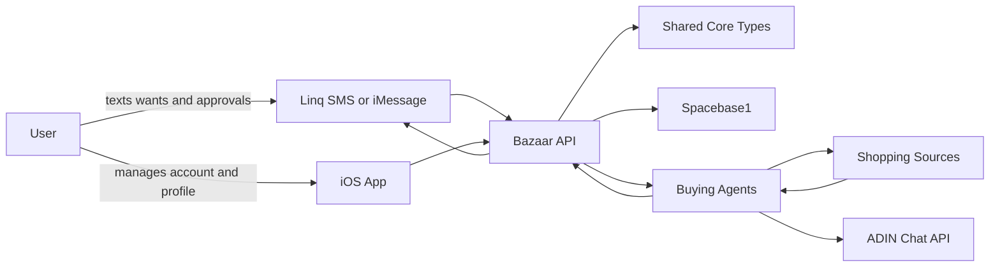

# Architecture

## System Shape



## Intent-Space Mapping

Every buyer want should be posted as an `INTENT`.

```text
Want INTENT
  Candidate listing INTENT
  Fit check PROMISE / COMPLETE
  Risk check PROMISE / COMPLETE
  Seller outreach PROMISE / COMPLETE
  Logistics child INTENT
```

The API can keep its own persistence for accounts, preferences, and operational state, but Spacebase should remain the visible coordination layer for agent work.

## Package Boundaries

### `packages/core`

Shared domain schemas and TypeScript types:

- `UserProfile`
- `BuyerPreference`
- `Want`
- `ListingCandidate`
- `AgentRole`

### `packages/spacebase`

Spacebase contracts and helpers:

- intent message shape
- projected promise act shape
- `SpacebaseClient` interface
- helper for creating buyer-want intents

### `packages/shopping`

Shopping interfaces:

- source adapters
- candidate scoring
- cross-source search fanout

### `packages/agents`

Agent contracts:

- profiler
- intent parser
- scout agents
- fit checker
- risk checker
- negotiator
- logistics

This package should start with interfaces and small orchestration helpers. Avoid porting all of `adin-chat` into this repo.

### `apps/api`

Lightweight web service:

- health endpoint
- Linq webhooks
- phone auth and OTP
- profile endpoints
- want intake
- Spacebase bridge
- agent orchestration entrypoint

### `apps/ios`

SwiftUI app:

- account management
- buyer profile
- active wants
- approval controls
- push/widget surfaces later

## Reuse Notes

From `world-hack`, reuse the pattern of adaptive interviews with structured tool calls that save profile facts during the conversation.

From `adin-chat`, reuse the orchestration pattern: a main model delegates to specialists with bounded depth and visible progress. Do not treat it as a drop-in swarm runtime.
