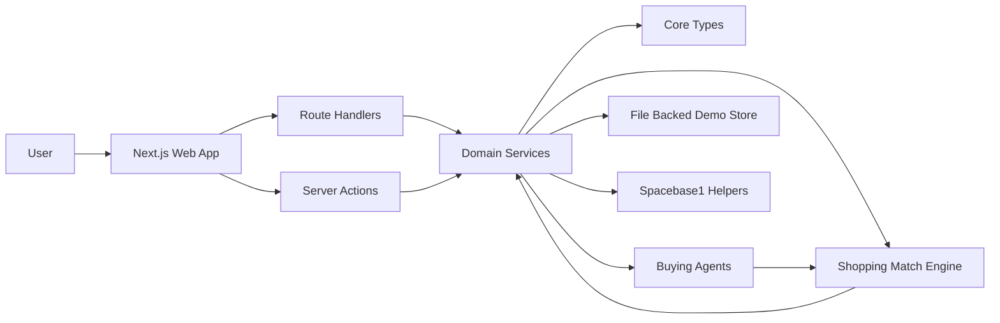

# Architecture

## System Shape



## Runtime Boundaries

The repo is now a single Next.js app at the root. Pages and server actions live in `app/`; reusable server logic and domain contracts live in `lib/`. API routes are native App Router route handlers under `app/api/`.

The dashboard uses server-side library calls directly for authenticated page data and form submissions. Route handlers remain available for external or client-side API calls.

## Intent-Space Mapping

Every buyer want can be posted as an `INTENT`.

```text
Want INTENT
  Candidate listing INTENT
  Fit check PROMISE / COMPLETE
  Risk check PROMISE / COMPLETE
  Seller outreach PROMISE / COMPLETE
  Logistics child INTENT
```

The app keeps its own demo persistence for users, sessions, wants, listings, and match runs. Spacebase should remain the visible coordination layer when the signed HTTP client is finished.

## Code Boundaries

### `lib/core`

Shared Zod schemas and TypeScript types, including `UserProfile`, `BuyerPreference`, `Want`, `ListingCandidate`, and `AgentRole`.

### `lib/spacebase-client`

Spacebase message contracts and helpers for `INTENT`, `PROMISE`, `ACCEPT`, and `COMPLETE` messages.

### `lib/shopping`

Shopping interfaces, seeded marketplace data, candidate scoring, and demo matching.

### `lib/agents`

Agent role contracts for profiler, parser, scouts, fit checker, risk checker, negotiator, and logistics.

### `lib/bazaar.ts`

Application service layer used by route handlers and server actions. It owns the demo want/listing flows, match execution, image intake, approval simulation, and health payload.
