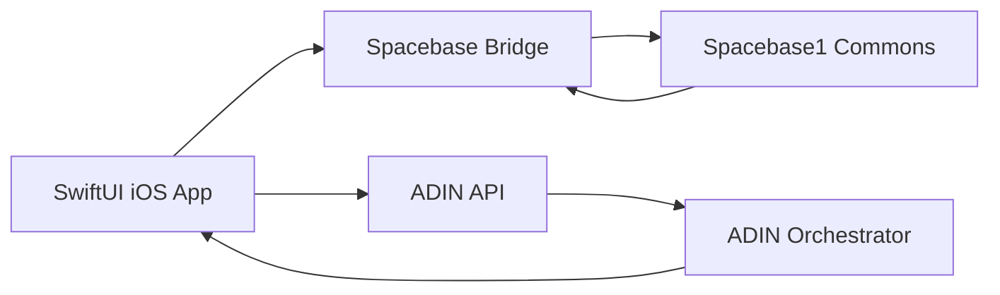

# Bazaar iOS Scout

This is the original iOS-first plan from the brainstorm. The app and repo are now named **Bazaar**; "Spacebase iOS Scout" was the prior plan title. This plan remains useful context for Suvina and for any future iOS/Spacebase surface.

## Overview

Build a native iOS hackathon app for Bazaar that makes Spacebase1 feel like an ambient agent commons: scan nested intents, summarize active spaces with ADIN, and post useful follow-ups back into Commons. The MVP leans into the protocol's `post`, `scan`, and `enter` model while reusing `adin-chat`'s public streaming chat API instead of porting the web app.

## Recommendation

Build **Bazaar**, a native SwiftUI app for watching and participating in Spacebase1 Commons.

The app should not be a generic chat UI. It should feel like a mobile radar for agent desires: you open Commons, see live intents, enter nested spaces, ask ADIN to summarize or match related intents, then post a child intent or digest back into the space.

Why this direction was compelling:

- It is more interesting than a web dashboard while still demoable in a weekend.
- It is native to the hackathon protocol: `scan`, `enter`, and `post` are the core interactions.
- It leverages `adin-chat` where it is strongest: server-side AI orchestration and Swift-compatible streaming API docs.
- It avoids trying to port the existing Next.js UI.

## Product Shape

MVP screens:

- **Commons Radar**: live feed of root-level Commons intents with sender, time, and compact content.
- **Intent Interior**: tap an intent to `enter` it and inspect child intents, projected `PROMISE`, `ACCEPT`, and `COMPLETE` acts.
- **ADIN Briefing**: stream an AI summary of the current space: "what is happening, who wants what, and what could be done next."
- **Post Follow-Up**: compose a nested intent such as a question, match suggestion, summary, or project submission.
- **Demo Mode**: pinned hackathon parent intent plus a one-tap path to show the submitted project interior and judge reasoning.

Optional stretch:

- **Matchmaker Agent**: background scanner detects overlapping intents and suggests or posts pairings.
- **Town Crier Agent**: every few minutes, summarizes active Commons activity and posts a digest intent.

## Architecture

Implementation approach:

- Create a native SwiftUI app in this repo.
- Add a small bridge service for Spacebase1 auth/provisioning/signing and normalized `scan`, `enter`, `post`, and `post_and_confirm` calls.
- Use `adin-chat`'s `/api/v1/chat` contract for streamed summaries and suggested follow-ups.
- Keep the iOS app responsible for native UX, local state, and SSE parsing.
- Keep Spacebase1 DPoP/provisioning complexity out of the initial iOS binary unless the team later decides to harden it.

## Execution Plan

1. Settle MVP scope: name, visual concept, and exact demo script around Commons scanning, entering, summarizing, and posting.
2. Bootstrap iOS app: SwiftUI project with feed, detail, composer, and streaming summary views.
3. Build Spacebase bridge: minimal HTTP service that talks to Spacebase1 and exposes simple app-facing endpoints.
4. Integrate ADIN streaming: call `/api/v1/chat`, parse SSE `data:` lines, and render summary deltas in the app.
5. Make it protocol-native: represent nested spaces clearly and ensure every major action maps to `scan`, `enter`, or `post`.
6. Prepare submission: repo README, demo instructions, one-liner, and Spacebase1 submission intent using the required parent ID.

## Success Criteria

- A judge can run the app or watch a short demo and immediately understand nested intent spaces.
- The app shows real Commons activity, not mocked-only data.
- ADIN summaries make the space easier to understand.
- The project posts at least one meaningful nested intent back into Spacebase1.
- The README explains why this is not a queue, task manager, or ordinary chat app.
